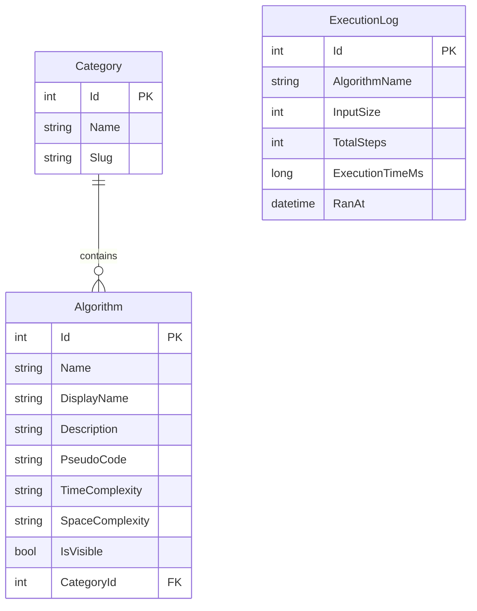

# Dokumentacja techniczna - Algorithms Visualizer

## Architektura ogólna

Aplikacja składa się z trzech warstw:

- **Frontend (React SPA)** - interfejs użytkownika, animacje wizualizacji algorytmów
- **Backend (ASP.NET Core MVC)** - logika algorytmów, REST API, panel administracyjny
- **Baza danych (SQLite + Entity Framework Core)** - przechowuje opisy algorytmów, kategorie i historię uruchomień

Algorytmy nie są implementowane po stronie frontendu - to backend w C# wykonuje algorytm krok po kroku i zwraca sekwencję stanów jako JSON. Frontend pełni rolę odtwarzacza tej sekwencji: pobiera kroki z API i animuje je użytkownikowi.

Komunikacja przebiega w obu kierunkach: frontend wysyła dane wejściowe (np. tablicę do posortowania) do backendu, a backend zwraca wyniki obliczeń i loguje uruchomienie do bazy danych.

```
[ React SPA ] ---HTTP/JSON---> [ ASP.NET Core API ] ---EF Core---> [ SQLite ]
   :5173                          :5192                              app.db
```

## Stack i decyzje technologiczne

### Backend - ASP.NET Core MVC

Algorytmy o większej złożoności czasowej (np. O(n²) dla większych tablic) wymagają wydajnego środowiska wykonawczego. C# z runtime .NET zapewnia kompilację AOT i wysoką wydajność obliczeniową, co przekłada się na płynne działanie aplikacji nawet przy złożonych algorytmach. Dodatkowo ASP.NET Core jest preferowanym stackiem w specyfikacji projektu.

### Frontend - React + Vite

React to jeden z najpopularniejszych frameworków frontendowych. Pozwala na łatwe zarządzanie stanem komponentów wizualizacji (kroki algorytmu, podświetlane elementy tablicy) przez hooks. Vite zapewnia szybki dev-server z hot module replacement, co znacznie przyspiesza pracę nad UI.

### Baza danych - SQLite

Projekt nie wymaga obsługi wielu jednoczesnych użytkowników ani zaawansowanych funkcji bazy. SQLite jako baza plikowa eliminuje konieczność konfiguracji serwera - kolega po klonowaniu repo nie musi instalować PostgreSQL ani konfigurować haseł. Jeśli projekt rozwiniemy do produkcji, migracja do PostgreSQL wymaga tylko zmiany providera w `Program.cs` - EF Core abstrahuje warstwę bazy.

### ORM - Entity Framework Core

EF Core pozwala definiować schemat bazy przez klasy C# (Code First) i zarządzać zmianami przez migracje. Eliminuje pisanie ręcznego SQL i zapewnia type safety na poziomie zapytań LINQ. Jest standardem w ekosystemie .NET - znajomość EF Core przekłada się na pracę w większości projektów .NET.

### Styling - Tailwind CSS

Utility-first podejście Tailwinda przyspiesza budowanie responsywnych interfejsów - zamiast pisać własne klasy CSS i zarządzać arkuszami stylów, klasy aplikuje się bezpośrednio w JSX. Wbudowane breakpointy (`sm:`, `md:`, `lg:`) ułatwiają realizację wymogu pełnej responsywności (RWD) wymaganego przez specyfikację projektu.



### Tabela `Category`

Przechowuje grupy algorytmów (np. _Sortowanie_, _Grafy_, _Wyszukiwanie_). Każda kategoria ma dwa pola tekstowe: `Name` to etykieta wyświetlana użytkownikowi (z polskimi znakami), `Slug` to URL-friendly wersja używana w trasach (np. `/categories/sorting`). Rozdzielenie nazwy i sluga to standardowy wzorzec w aplikacjach webowych - pozwala zmieniać widoczną nazwę bez psucia istniejących linków.

### Tabela `Algorithm`

Przechowuje definicje algorytmów: nazwę techniczną (`Name`), nazwę wyświetlaną (`DisplayName`), opis, pseudokod oraz złożoność czasową i pamięciową. Klucz obcy `CategoryId` łączy algorytm z kategorią (relacja many-to-one - wiele algorytmów może należeć do jednej kategorii). Pole `IsVisible` pozwala administratorowi tymczasowo ukryć algorytm bez jego usuwania z bazy - np. gdy opis jest niekompletny lub wymaga poprawek.

### Tabela `ExecutionLog`

Przechowuje historię uruchomień algorytmów: nazwę algorytmu, rozmiar danych wejściowych, liczbę wygenerowanych kroków, czas wykonania w milisekundach oraz datę uruchomienia. **Świadomie nie używamy klucza obcego do `Algorithm`** - zamiast tego trzymamy `AlgorithmName` jako string. Dzięki temu logi pozostają w bazie nawet po usunięciu algorytmu przez administratora, co pozwala zachować pełną historię analityczną aplikacji.
