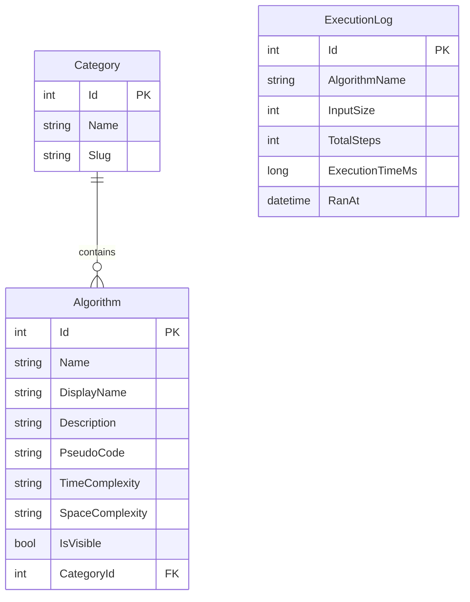

# Dokumentacja techniczna - Algorithms Visualizer

## Architektura ogólna

Aplikacja składa się z trzech warstw:

- **Frontend (React SPA)** - interfejs użytkownika, animacje wizualizacji algorytmów
- **Backend (ASP.NET Core MVC)** - logika algorytmów, REST API, panel administracyjny
- **Baza danych (SQLite + Entity Framework Core)** - przechowuje opisy algorytmów, kategorie i historię uruchomień

Algorytmy nie są implementowane po stronie frontendu - to backend w C# wykonuje algorytm krok po kroku i zwraca sekwencję stanów jako JSON. Frontend pełni rolę odtwarzacza tej sekwencji: pobiera kroki z API i animuje je użytkownikowi.

Komunikacja przebiega w obu kierunkach: frontend wysyła dane wejściowe (np. tablicę do posortowania) do backendu, a backend zwraca wyniki obliczeń i loguje uruchomienie do bazy danych.

```
[ React SPA ] ---HTTP/JSON---> [ ASP.NET Core API ] ---EF Core---> [ SQLite ]
   :5173                          :5192                              app.db
```

## Stack i decyzje technologiczne

### Backend - ASP.NET Core MVC

Algorytmy o większej złożoności czasowej (np. O(n²) dla większych tablic) wymagają wydajnego środowiska wykonawczego. C# z runtime .NET zapewnia kompilację AOT i wysoką wydajność obliczeniową, co przekłada się na płynne działanie aplikacji nawet przy złożonych algorytmach. Dodatkowo ASP.NET Core jest preferowanym stackiem w specyfikacji projektu.

### Frontend - React + Vite

React to jeden z najpopularniejszych frameworków frontendowych. Pozwala na łatwe zarządzanie stanem komponentów wizualizacji (kroki algorytmu, podświetlane elementy tablicy) przez hooks. Vite zapewnia szybki dev-server z hot module replacement, co znacznie przyspiesza pracę nad UI.

### Baza danych - SQLite

Projekt nie wymaga obsługi wielu jednoczesnych użytkowników ani zaawansowanych funkcji bazy. SQLite jako baza plikowa eliminuje konieczność konfiguracji serwera - kolega po klonowaniu repo nie musi instalować PostgreSQL ani konfigurować haseł. Jeśli projekt rozwiniemy do produkcji, migracja do PostgreSQL wymaga tylko zmiany providera w `Program.cs` - EF Core abstrahuje warstwę bazy.

### ORM - Entity Framework Core

EF Core pozwala definiować schemat bazy przez klasy C# (Code First) i zarządzać zmianami przez migracje. Eliminuje pisanie ręcznego SQL i zapewnia type safety na poziomie zapytań LINQ. Jest standardem w ekosystemie .NET - znajomość EF Core przekłada się na pracę w większości projektów .NET.

### Styling - Tailwind CSS

Utility-first podejście Tailwinda przyspiesza budowanie responsywnych interfejsów - zamiast pisać własne klasy CSS i zarządzać arkuszami stylów, klasy aplikuje się bezpośrednio w JSX. Wbudowane breakpointy (`sm:`, `md:`, `lg:`) ułatwiają realizację wymogu pełnej responsywności (RWD) wymaganego przez specyfikację projektu.



### Tabela `Category`

Przechowuje grupy algorytmów (np. _Sortowanie_, _Grafy_, _Wyszukiwanie_). Każda kategoria ma dwa pola tekstowe: `Name` to etykieta wyświetlana użytkownikowi (z polskimi znakami), `Slug` to URL-friendly wersja używana w trasach (np. `/categories/sorting`). Rozdzielenie nazwy i sluga to standardowy wzorzec w aplikacjach webowych - pozwala zmieniać widoczną nazwę bez psucia istniejących linków.

### Tabela `Algorithm`

Przechowuje definicje algorytmów: nazwę techniczną (`Name`), nazwę wyświetlaną (`DisplayName`), opis, pseudokod oraz złożoność czasową i pamięciową. Klucz obcy `CategoryId` łączy algorytm z kategorią (relacja many-to-one - wiele algorytmów może należeć do jednej kategorii). Pole `IsVisible` pozwala administratorowi tymczasowo ukryć algorytm bez jego usuwania z bazy - np. gdy opis jest niekompletny lub wymaga poprawek.

### Tabela `ExecutionLog`

Przechowuje historię uruchomień algorytmów: nazwę algorytmu, rozmiar danych wejściowych, liczbę wygenerowanych kroków, czas wykonania w milisekundach oraz datę uruchomienia. **Świadomie nie używamy klucza obcego do `Algorithm`** - zamiast tego trzymamy `AlgorithmName` jako string. Dzięki temu logi pozostają w bazie nawet po usunięciu algorytmu przez administratora, co pozwala zachować pełną historię analityczną aplikacji.

## API

API to kilka endpointów REST, które zwracają dane w JSON-ie. Korzysta z nich frontend React, np. żeby pobrać algorytmy, odpalić wizualizację albo porównać sortowania.

### Dostępne endpointy

| Metoda | Ścieżka                   | Opis                                                                                                         |
| ------ | ------------------------- | ------------------------------------------------------------------------------------------------------------ |
| GET    | `/api/algorithms`         | Lista widocznych algorytmów razem z kategoriami.                                                             |
| GET    | `/api/algorithms/{id}`    | Szczegóły jednego algorytmu.                                                                                 |
| POST   | `/api/algorithms/execute` | Uruchamia algorytm i zwraca kroki animacji, liczbę kroków oraz czas wykonania. Zapisuje też wpis w historii. |
| POST   | `/api/algorithms/compare` | Porównuje algorytmy sortowania na tych samych danych i zwraca wyniki dla każdego z nich.                     |

### Architektura serwisów algorytmów

Algorytmy są podzielone na trzy grupy: sortowanie, wyszukiwanie i grafy. Każda grupa ma własny interfejs, więc kod nie miesza różnych typów algorytmów w jednym worku.

Każdy serwis implementuje odpowiedni interfejs:

- `ISortingAlgorithm` - algorytmy sortowania: Bubble Sort, Selection Sort, Insertion Sort, Merge Sort
- `ISearchingAlgorithm` - algorytmy wyszukiwania: Binary Search
- `IGraphAlgorithm` - algorytmy grafowe: BFS, DFS

Serwisy są rejestrowane w Dependency Injection jako `Scoped`. `AlgorithmsController` dostaje listy `IEnumerable<I...>` i wybiera konkretny algorytm po polu `Name`, np. `bubble`, `dfs` albo `binary-search`. Dzięki temu nowy algorytm to głównie nowa klasa i wpis w `Program.cs`, a nie przepisywanie kontrolera.

### Walidacja i błędy

API używa zwykłych kodów HTTP:

- `200 OK` - wszystko się udało, zwracamy dane JSON
- `400 Bad Request` - brakuje danych albo request jest niepoprawny
- `404 Not Found` - nie ma algorytmu o takim `id` albo takiej nazwie

Kontroler sprawdza m.in. czy `InputData` nie jest puste, czy Binary Search ma `Target`, czy graf ma `Vertices`, `Edges` i `StartVertex`, oraz czy przy porównaniu podano `AlgorithmNames`.

### Pełna dokumentacja API

Pełna dokumentacja z parametrami i przykładami jest pod `/swagger` w trybie deweloperskim. Generuje ją automatycznie Swashbuckle.

## Algorytmy

W tym projekcie algorytmy to konkretne klasy w C#, które wykonują się po stronie serwera. Obecnie mamy 7 algorytmów: 4 sortowania, 1 wyszukiwania i 2 grafowe. Każdy z nich nie zwraca tylko końcowego wyniku, ale całą listę kroków, którą frontend może potem ładnie odtworzyć jako animację.

### Reprezentacja kroku - `AlgorithmStep`

Sortowanie i wyszukiwanie zwracają listę obiektów `AlgorithmStep`. Każdy krok opisuje jeden stan tablicy. Tablica jest klonowana przy każdym kroku, żeby frontend miał gotową "klatkę" animacji i mógł odtworzyć ją od dowolnego momentu.

Pola `AlgorithmStep`:

- `StepIndex` - numer kroku
- `Array` - aktualny stan tablicy
- `Comparing` - indeksy elementów, które są teraz sprawdzane
- `SortedIndices` - indeksy uznane za gotowe albo znalezione
- `Swapped` - informacja, czy w tym kroku była zamiana
- `Description` - krótki opis dla użytkownika

### Algorytmy sortowania

Wszystkie sortowania implementują `ISortingAlgorithm` i pracują na tablicy liczb:

- Bubble Sort - porównuje sąsiednie elementy i przepycha większe wartości na koniec
- Selection Sort - szuka najmniejszego elementu i wstawia go na właściwe miejsce
- Insertion Sort - buduje posortowaną część tablicy, dokładając elementy jeden po drugim
- Merge Sort - dzieli tablicę na mniejsze części, sortuje je i scala z powrotem

### Algorytmy wyszukiwania

Do wyszukiwania mamy Binary Search. Algorytm sprawdza środkowy element, a potem odrzuca połowę zakresu, więc działa szybko, ale zakłada posortowane dane. Ma osobny interfejs `ISearchingAlgorithm`, bo oprócz tablicy potrzebuje jeszcze wartości `Target`, czyli tego, czego szukamy.

### Algorytmy grafowe

Algorytmy grafowe to BFS i DFS. Używają osobnego DTO `GraphAlgorithmStep`, bo graf ma inne dane niż tablica: wierzchołki, krawędzie, odwiedzone elementy, kolejkę/stos jako `Frontier` i aktualny wierzchołek `Current`.

BFS wyszukuje sąsiadów prostym przejściem po krawędziach, więc jest czytelny, ale mniej wydajny (`O(V * E)`). DFS najpierw buduje listę sąsiedztwa, dzięki czemu działa wydajniej (`O(V + E)`). Fajnie to pokazuje różnicę między prostszą implementacją a bardziej zoptymalizowaną.

### Dodawanie nowego algorytmu

Dodanie nowego algorytmu jest dość proste:

1. Stwórz klasę implementującą odpowiedni interfejs
2. Zaimplementuj `Execute`, tak żeby generowało kroki animacji
3. Zarejestruj serwis w `Program.cs` przez `AddScoped`
4. Dodaj wpis w `DbSeeder`, jeśli algorytm ma być widoczny w UI

Kontrolera zwykle nie trzeba ruszać, bo dostaje automatycznie wszystkie implementacje przez Dependency Injection.
